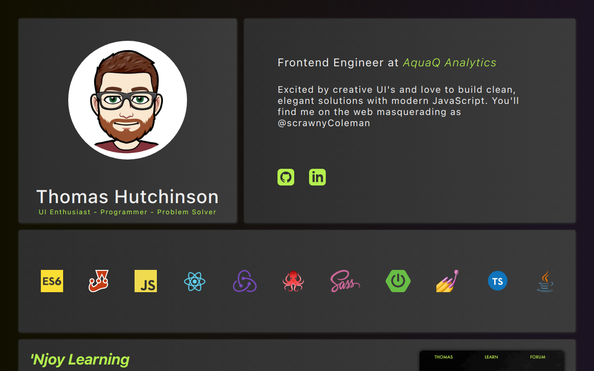

<h1 align="center">Portfolio</h1>

This UI was built using React, deployed to vercel <a href="https://thomashutchinson.dev">here</a>.

    <code>
        
    </code>
    <code>
        
    </code>
    <code>
        
    </code>

 

